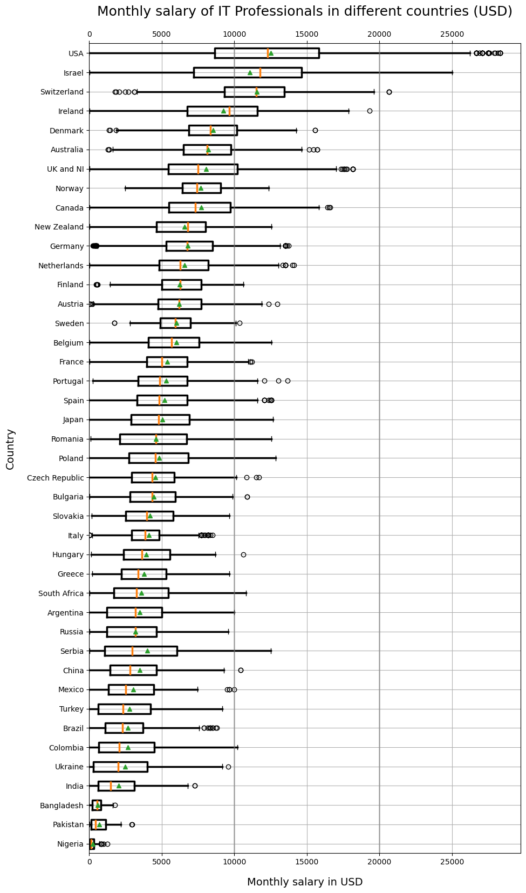

# IT market analysis 2025
Using Stack Overflow 2025 Survey and variables `age, education level, years of experience, salary, country, years of coding experience, size of organization working in, industry working in, AI frequency of using` . The analysis is based on 42 countries to preserve statistical significance.

## Graphs preview

## Contains:
`IT_job_market_analysis.ipynb`  - main file

## Features:

The data used was manually cleaned. 

The interested columns were extracted. Then handled missing data to ensure analysis consistency empty values were cut. 

Outliers were also cut using Tukey's method to eliminate false declarations. The salary data was converted into monthly basis to get more intuitive view.

Mapping the data to make string values usable.

Boxplot graph to present `Monthly salary of IT Professionals in different countries`

## Future improvements:

Further analysis e.g. **correlation** between salary and other variables

More **graphs** representing the data

**Report** to better present analysis and make it readable

Addressing warnings
